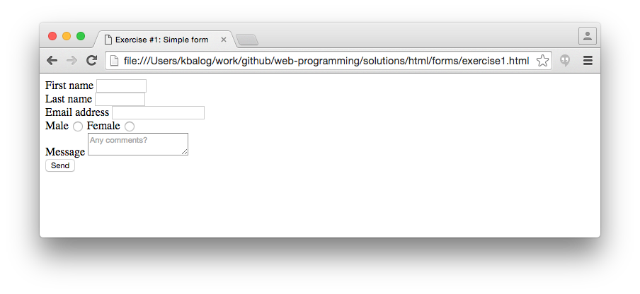

# HTML forms

## Exercise #1: Simple form

Create the form below.

  - First and last name have a width of 10 characters; the user may enter up to 20 characters in each.
  - Email has a width of 20 characters; the user may enter an email address up to 35 characters long.
    * Use the HTML5 email input type.
  - First and last names, and email are obligatory. The other fields are optional.
  - Label the input elements using `<label>`.
  - The submit button should have the label _Send_.

## Exercise #2: Subscription form

Create the form below.

  - Personal details:
    * First and last name as text inputs, email address as input type email.
    * Gender (male/female) as radio buttons (by default none of them is selected).
  - List of magazines to be selected with checkboxes.
  - Subscription period as a select list: 6, 12, 18, or 24 months.
  - The submit button is labeled as "Subscribe".
  - Use css to style the form:
    * Set a fixed width for the fieldsets, apply a background color, and align them in the middle of the page. 
    * Align the fields. (Hint: you can set the width property of the `<label>` tag.)
    * Align the submit button in the middle of the page.

## Exercise #3: HTML5 form elements

Try some of the [HTML5 input types](www.w3schools.com/html/html_form_input_types.asp), e.g., color, url, search, date, etc.
How are these displayed in different browsers?
